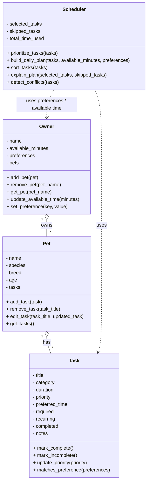

```mermaid
classDiagram
    class Owner {
        - name
        - available_minutes
        - preferences
        - pets
        + add_pet(pet)
        + remove_pet(pet_name)
        + get_pet(pet_name)
        + update_available_time(minutes)
        + set_preference(key, value)
    }

    class Pet {
        - name
        - species
        - breed
        - age
        - tasks
        + add_task(task)
        + remove_task(task_title)
        + edit_task(task_title, updated_task)
        + get_tasks()
    }

    class Task {
        - title
        - category
        - duration
        - priority
        - preferred_time
        - required
        - recurring
        - completed
        - notes
        + mark_complete()
        + mark_incomplete()
        + update_priority(priority)
        + matches_preference(preferences)
    }

    class Scheduler {
        - selected_tasks
        - skipped_tasks
        - total_time_used
        + prioritize_tasks(tasks)
        + build_daily_plan(tasks, available_minutes, preferences)
        + sort_tasks(tasks)
        + explain_plan(selected_tasks, skipped_tasks)
        + detect_conflicts(tasks)
    }

    Owner "1" o-- "*" Pet : owns
    Pet "1" o-- "*" Task : has
    Scheduler ..> Task : uses
    Scheduler ..> Owner : uses preferences / available time
```